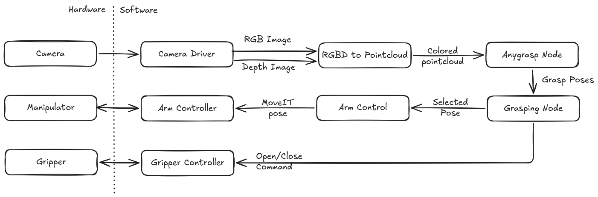

# Grasping Stack

This package provides grasping functionality for [UR robots](https://www.universal-robots.com/) with the help of a [RealSense Camera](https://github.com/realsenseai/realsense-ros). 

## System Architecture



### Camera Driver

Camera setup, configuration, and customization are documented in the linked file. The current supported device is:

- [Realsense Camera](./docs/camera/realsense.md)

### Gripper Controller

In this grasping framework, we evaluate different gripper types. Due to this we focus on custom built grippers and our gripper controller revolves around different types for servos used to build the grippers and are availble in [CollaborativeRoboticsLab/grippers](https://github.com/CollaborativeRoboticsLab/grippers). Instructions related to setup, configuration and customization are in the linked file.

- [Dynamixel Grippers](https://github.com/CollaborativeRoboticsLab/grippers/blob/main/docs/dynamixel.md)
- [Feetech Grippers](https://github.com/CollaborativeRoboticsLab/grippers/blob/main/docs/feetech.md)

### Arm Controller

In this grasping framework, we utilize the UR10 manipulator and TM12s manipulator. Instructions related to setup, configuration and calibration are in the linked files.

**UR10 Manipulator**
- [UR10 and Devcontainer connection](./docs/manipulator/ur10_connection.md)
- [UR10 calibration](./docs/manipulator/ur10_calibration.md)
- [UR10 tf frames for gripper compatibility](./docs/manipulator/ur10_tf_frames.md)
- [UR10 startup](./docs/manipulator/ur10_startup.md)

**TM12S Manipulator**
- [TM12S and Devcontainer connection](./docs/manipulator/tm12s_connection.md)
- [TM12S tf frames for gripper compatibility](./docs/manipulator/tm12s_tf_frames.md)

**Common**
- [Attaching new gripper and components](./docs/manipulator/adding_new_components.md)
- [Moveit Servo and Keyboard Teleop](./docs/manipulator/teleop.md)

### Arm Control and Workspace Creation

This component transforms grasp poses, applies workspace obstacles to MoveIt, visualizes the calibrated workspace area, and rejects poses outside that area.

- [Workspace Creation](./docs/workspace/creation.md)
- [Arm Control](./docs/control/arm_control.md)
- [Control stack overview](./docs/control/control_stack_overview.md)

### Grasping Pipeline

An external stack is typically used to detect or calculate a grasp pose, and this grasping stack is used to execute motion to that pose. One example of such an external system is listed below.

- [Anygrasp based Grasping pipeline](https://github.com/CollaborativeRoboticsLab/anygrasp_grasping)


## Starting the camera

Use the following command to start the realsense D435 camera.

```bash
source install/setup.bash
ros2 launch grasping_camera d435.launch.py
```

## Start the UR10 Manipulator and Gripper with MoveIt

### For `UR10 only`

```bash
source install/setup.bash
ros2 launch grasping_control ur10.launch.py
```

### For `UR10 with soft two-finger gripper`

```bash
source install/setup.bash
ros2 launch grasping_control ur10_soft_two_fingers.launch.py
```