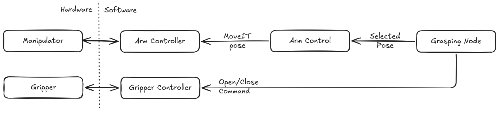

# Grasping Stack

This package provides grasping functionality using [RealSense Camera](https://github.com/realsenseai/realsense-ros) and [custom grippers](https://github.com/CollaborativeRoboticsLab/grippers). The grasping stack is designed to be modular and can be used with different manipulators, grippers, and grasp pose detectors.

This stack has extensions to support following manipulators:

- UR Robots via [CollaborativeRoboticsLab/grasping_ur](https://github.com/CollaborativeRoboticsLab/grasping_ur)
- TM Robots via [CollaborativeRoboticsLab/grasping_tm](https://github.com/CollaborativeRoboticsLab/grasping_tm)
- Omron Mobile Manipulator Robots via [CollaborativeRoboticsLab/grasping_omron_moma](https://github.com/CollaborativeRoboticsLab/grasping_omron_moma)

And also supports grasping pose detectors like 
- [AnyGrasp](https://github.com/CollaborativeRoboticsLab/anygrasp_ros) via [CollaborativeRoboticsLab/grasping_anygrasp](https://github.com/CollaborativeRoboticsLab/grasping_anygrasp)

## System Architecture

### Gripper Controller

In this grasping framework, we evaluate different gripper types. Due to this we focus on custom built grippers and our gripper controller revolves around different types for servos used to build the grippers and are availble in [CollaborativeRoboticsLab/grippers](https://github.com/CollaborativeRoboticsLab/grippers). Instructions related to setup, configuration and customization are in the linked file.

- [Dynamixel Grippers](https://github.com/CollaborativeRoboticsLab/grippers/blob/main/docs/dynamixel.md)
- [Feetech Grippers](https://github.com/CollaborativeRoboticsLab/grippers/blob/main/docs/feetech.md)

### Manipulator

In this grasping framework, we have tested with the UR10, TM12s manipulators and LD250 & TM12x mobile manipulator. Instructions related to setup, configuration and calibration are in the linked files.

- [UR10 Manipulator](https://github.com/CollaborativeRoboticsLab/grasping_ur)
- [TM12s Manipulator](https://github.com/CollaborativeRoboticsLab/grasping_tm)
- [LD250 & TM12x Mobile Manipulator](https://github.com/CollaborativeRoboticsLab/grasping_omron_moma)
- [Attaching new gripper and components](./docs/manipulator/adding_new_components.md)
- [Moveit Servo and Keyboard Teleop](./docs/manipulator/teleop.md)

### Manipulator Control and Workspace Creation

This component transforms grasp poses, applies workspace obstacles to MoveIt, visualizes the calibrated workspace area, and rejects poses outside that area.

- [Workspace Creation](./docs/workspace/creation.md)
- [Arm Control](./docs/control/arm_control.md)
- [Control stack overview](./docs/control/control_stack_overview.md)

### Grasping Pipeline

An external stack is typically used to detect or calculate a grasp pose, and this grasping stack is used to execute motion to that pose. One example of such an external system is listed below.

- [Anygrasp based Grasping pipeline](https://github.com/CollaborativeRoboticsLab/anygrasp_grasping)

## Usage

Refer to the Manipulator specific grasping stack for usage instructions.

For motion execution, use the following command to execute a grasp pose:

For named poses, use the following command to execute a grasp pose: