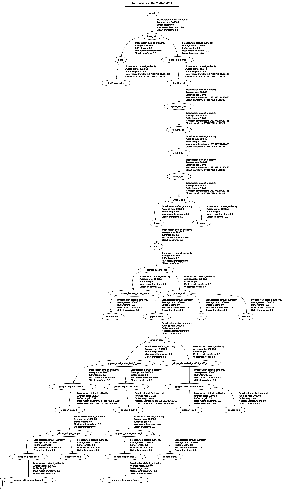

# TF Frames of the system

Following are the color conventions used with Rviz2
- Red - X axis
- Green - Y axis
- Blue - Z axis

Following transformations are the main standard and custom tf defined in this system to attach the subcomponents together. These are in ["x", "y", "z", "qx", "qy", "qz", "qw"] format.

## Base and arm mounting frames

### base_link

`base_link` is the planning frame used by the combined `ld250_tm12x_soft_two_fingers` MoveIt configuration.

### ld250_base_link

This is the mobile base frame created by the LD250 model. In the combined model it is attached directly under `base_link`.

```
base_link -> ld250_base_link transformation is, [0, 0, 0, 0, 0, 0, 1]
```

### controlbox

The TM control box is mounted above the LD250 base.

```
ld250_base_link -> controlbox transformation is, [0, 0, 0.38, 0, 0, 0, 1]
```

### base

`base` is the root link of the TM12X arm. It is mounted to the control box support offset.

```
controlbox -> base transformation is, [0.2, 0, 0.325, 0, 0, 0, 1]
```

## TM12X end-effector frames

### flange

This is the last arm frame of the TM12X robot model used in this system. The camera mount is not attached directly to this frame.

### tmee_spacer_link

This spacer is mounted directly on the TM12X flange and is used as the adapter between the robot and the camera mount.

```
flange -> tmee_spacer_link transformation is, [0, 0, 0, 0, 0, 0, 1]
```

### camera_mount_link

The camera mount is a child of `tmee_spacer_link` and is rotated by 180 degrees about the Z axis.

```
tmee_spacer_link -> camera_mount_link transformation is, [0, 0, 0.055, 0, 0, 0.9999997, 0.0007963]
```

## gripper_root

This is the base of the gripper and is a child of `camera_mount_link` as it is mounted on the camera mount.

```
camera_mount_link -> gripper_root transformation is, [0, 0, 0.008, 0, 0, 0, 1]
```

## gripper_clamp

This is the clamp of the gripper and is a child of gripper_root.

```
gripper_root -> gripper_clamp transformation is, [0, 0, 0, 0, 0, -0.707108, 0.707105]
```

## tcp (Tool Center Point)

This is the point on the gripper where the object is grasped and is a child of gripper_root.

```
gripper_root -> tcp transformation is, [0, 0, 0.205, 0, 0, 0, 1]
```

## tool_tip

This is the end point of the gripper and is a child of gripper_root.

```
gripper_root -> tool_tip transformation is, [0, 0, 0.25, 0, 0, 0, 1]
```

## TF tree

