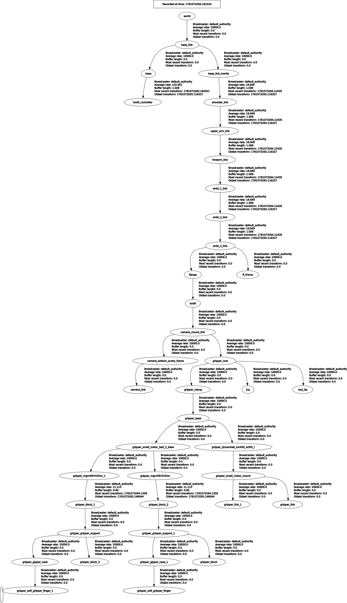

# TF Frames of the system

Following are the color conventions used with Rviz2
- Red - X axis
- Green - Y axis
- Blue - Z axis

Following transformations are ["x", "y", "z", "qx", "qy", "qz", "qw"]

Quaternion values below are rounded to 6 decimal places.

## tool0 

This is last tf of the ur10 robot. This shows Z axis outwards, X axis downwards.


## camera_mount_link

This is the inner surface of the camera mount facing the ur10 tool mount and is a child of tool0.

```
tool0 -> camera_mount_link transformation is, [0, 0, 0.008, 0, 0, 0, 1]
```

## camera_bottom_screw_frame

This is the RealSense D435 tripod-mount frame and is a child of camera_mount_link.

```
camera_mount_link -> camera_bottom_screw_frame transformation is, [-0.085, 0, 0.035, 0, -0.706825, 0, 0.707388]
```

## camera_link

This is the camera body frame and is a child of camera_bottom_screw_frame.

```
camera_bottom_screw_frame -> camera_link transformation is, [0.0106, 0.0175, 0.0125, 0, 0, 0, 1]
```

## gripper_root

This is the base of the gripper and is a child of camera_mount_link as it is mounted on the camera mount.

```
camera_mount_link -> gripper_root transformation is, [0, 0, 0, 0, 0, 0.706825, 0.707388]
```

## gripper_clamp

This is the clamp of the gripper and is a child of gripper_root.

```
gripper_root -> gripper_clamp transformation is, [0, 0, 0, 0, 0, -0.707108, 0.707105]
```

## tcp (Tool Center Point)

This is the point on the gripper where the object is grasped and is a child of gripper_root.

```
gripper_root -> tcp transformation is, [0, 0, 0.205, 0, 0, 0, 1]
```

## tool_tip

This is the end point of the gripper and is a child of gripper_root.

```
gripper_root -> tool_tip transformation is, [0, 0, 0.25, 0, 0, 0, 1]
```

## TF tree

