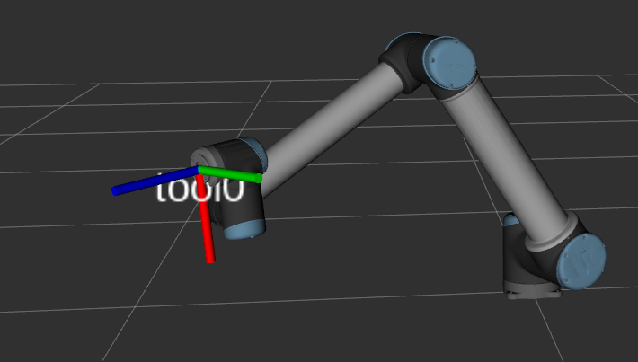

# TF Frames of the system

Following are the color conventions used with Rviz2
- Red - X axis
- Green - Y axis
- Blue - Z axis

Following transformations are ["x", "y", "z", "qx", "qy", "qz", "qw"]

## tool0 

This is last tf of the ur10 robot. This shows Z axis outwards, X axis downwards.

## camera_mount_link

This is the inner surface of the camera mount facing the ur10 tool mount and is a child of tool0.

tool0 -> camera_mount_link transformation is, [0, 0, 0, 0, 0, 0, 0]

## camera_link

This is the lower surface of the camera facing the camera mount and is a child of tool0.

camera_mount_link -> camera_link transformation is, [0, 0, 0, 0, 0, 0, 0]